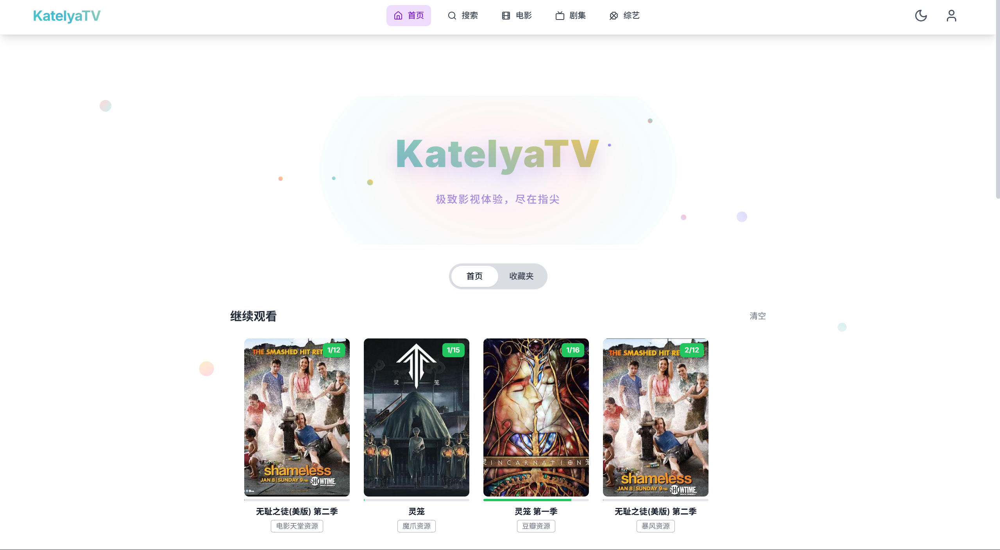
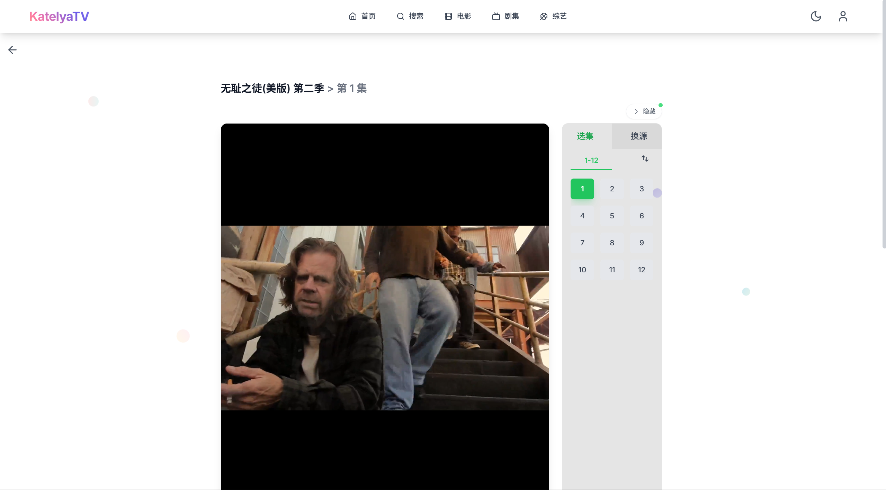
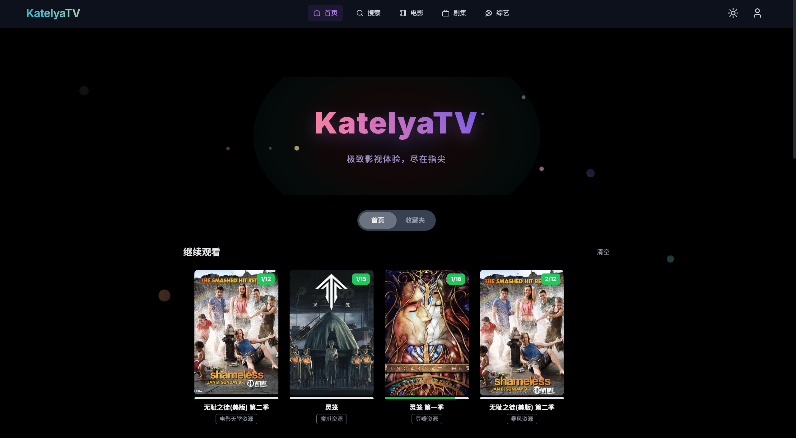
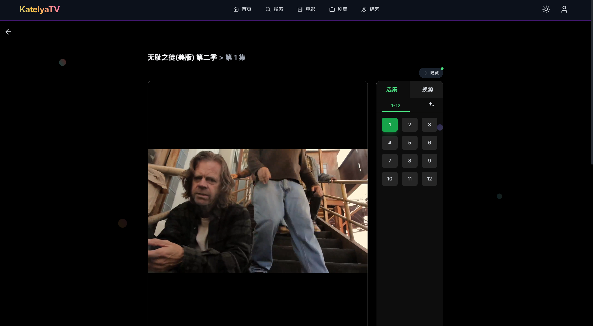

# KatelyaTV

<div align="center">
  
</div>

> 🎬 **KatelyaTV** 是一个开箱即用的、跨平台的影视聚合播放器。它基于 **Next.js 14** + **Tailwind&nbsp;CSS** + **TypeScript** 构建，支持多资源搜索、在线播放、收藏同步、播放记录、本地/云端存储，让你可以随时随地畅享海量免费影视内容。
>
> 本项目是在原始项目「MoonTV」基础上的二创与继承版本，由 Katelya 持续开发与维护。在致敬原作的前提下，继续修复问题、优化体验并扩展功能。

<div align="center">


</div>

---

## 📸 Screenshot

<div align="center">

<table>
  <tr>
    <td></td>
    <td></td>
  </tr>
  <tr>
    <td></td>
    <td></td>
  </tr>
</table>

</div>

---

## ✨ 功能特性

- 🔍 **多源聚合搜索**：内置20+个免费资源站点，一次搜索立刻返回全源结果，支持电影、电视剧、综艺等多种类型。
- 📄 **丰富详情页**：支持剧集列表、演员、年份、简介等完整信息展示，集成豆瓣评分和热门推荐。
- ▶️ **流畅在线播放**：集成 HLS.js & ArtPlayer，支持多种视频格式，自动跳过广告切片。
- 📺 **观看历史记录**：智能记录播放进度，支持断点续播，多设备同步观看状态。
- ❤️ **收藏 + 继续观看**：支持 Redis/D1/Upstash 存储，多端同步进度，个性化推荐。
- 📱 **PWA 支持**：离线缓存、安装到桌面/主屏，移动端原生体验，支持推送通知。
- 🌗 **响应式布局**：桌面侧边栏 + 移动底部导航，自适应各种屏幕尺寸，支持深色模式。
- 👥 **多用户系统**：支持用户注册、登录、权限管理，数据隔离和同步。
- 🚀 **极简部署**：一条 Docker 命令即可将完整服务跑起来，或免费部署到 Vercel 和 Cloudflare。
- 🎨 **现代化UI**：基于 Tailwind CSS 构建，支持主题切换，流畅的动画效果。

<details>
  <summary>点击查看项目截图</summary>
  
  
  
</details>

## 🗺 目录

- [技术栈](#技术栈)
- [核心功能](#核心功能)
- [项目来源与声明](#项目来源与声明)
- [部署](#部署)
- [Docker 部署详解](#Docker-部署详解)
- [Docker Compose 最佳实践](#Docker-Compose-最佳实践)
- [环境变量](#环境变量)
- [配置说明](#配置说明)
- [管理员配置](#管理员配置)
- [AndroidTV 使用](#AndroidTV-使用)
- [Roadmap](#roadmap)
- [安全与隐私提醒](#安全与隐私提醒)
- [License](#license)
- [致谢](#致谢)

## 🛠 技术栈

| 分类      | 主要依赖                                                                                              |
| --------- | ----------------------------------------------------------------------------------------------------- |
| 前端框架  | [Next.js 14](https://nextjs.org/) · App Router                                                        |
| UI & 样式 | [Tailwind&nbsp;CSS 3](https://tailwindcss.com/) · [Framer Motion](https://www.framer.com/motion/)     |
| 语言      | TypeScript 4                                                                                          |
| 播放器    | [ArtPlayer](https://github.com/zhw2590582/ArtPlayer) · [HLS.js](https://github.com/video-dev/hls.js/) |
| 状态管理  | React Hooks · Context API                                                                             |
| 代码质量  | ESLint · Prettier · Jest · Husky                                                                      |
| 部署      | Docker · Vercel · CloudFlare pages                                                                    |

## 🎯 核心功能

### 观看历史记录

- **智能进度记录**：自动记录每个视频的播放进度、观看时长、当前集数
- **断点续播**：支持从上次观看位置继续播放，无需手动寻找
- **多设备同步**：通过 Redis/D1/Upstash 存储，实现跨设备观看记录同步
- **历史管理**：支持查看、删除单条记录或清空全部历史
- **进度条显示**：在视频卡片上显示观看进度百分比

### 多源聚合搜索

- **20+ 资源站点**：集成电影天堂、黑木耳、如意资源等热门站点
- **统一搜索接口**：一次搜索返回多个源的结果，提高资源获取成功率
- **智能去重**：自动识别重复内容，优化搜索结果展示
- **分类筛选**：支持按电影、电视剧、综艺等类型筛选

### 收藏与同步

- **个性化收藏**：支持收藏喜欢的影视作品，创建个人片单
- **多端同步**：收藏数据云端存储，多设备访问保持一致
- **观看状态**：收藏夹中显示观看进度和当前集数
- **批量管理**：支持批量删除和清空收藏

### PWA 特性

- **离线缓存**：支持离线访问已缓存的内容
- **桌面安装**：可安装到桌面，提供原生应用体验
- **推送通知**：支持新内容推送和更新提醒
- **响应式设计**：完美适配各种屏幕尺寸

## 📢 项目来源与声明

- 本项目自「MoonTV」演进而来，为其二创/继承版本，持续维护与改进功能与体验。
- 代码中保留并致谢原有作者与社区贡献者；如有授权或版权问题，请与我们联系以尽快处理。
- KatelyaTV 致力于在原作优秀基础上，提供更易部署、更友好、更稳定的使用体验。

## 🚀 部署

本项目**支持 Vercel、Docker 和 Cloudflare** 部署。

### 存储支持矩阵

|               | Docker | Vercel | Cloudflare |
| :-----------: | :----: | :----: | :--------: |
| localstorage  |   ✅   |   ✅   |     ✅     |
|  原生 redis   |   ✅   |        |            |
| Cloudflare D1 |        |        |     ✅     |
| Upstash Redis |   ☑️   |   ✅   |     ☑️     |

✅：经测试支持  
☑️：理论上支持，未测试

除 localstorage 方式外，其他方式都支持多账户、记录同步和管理页面

### Vercel 部署

#### 普通部署（localstorage）

1. **Fork** 本仓库到你的 GitHub 账户。
2. 登陆 [Vercel](https://vercel.com/)，点击 **Add New → Project**，选择 Fork 后的仓库。
3. 设置 PASSWORD 环境变量。
4. 保持默认设置完成首次部署。
5. 如需自定义 `config.json`，请直接修改 Fork 后仓库中该文件。
6. 每次 Push 到 `main` 分支将自动触发重新构建。

部署完成后即可通过分配的域名访问，也可以绑定自定义域名。

#### Upstash Redis 支持

0. 完成普通部署并成功访问。
1. 在 [upstash](https://upstash.com/) 注册账号并新建一个 Redis 实例，名称任意。
2. 复制新数据库的 **HTTPS ENDPOINT 和 TOKEN**
3. 返回你的 Vercel 项目，新增环境变量 **UPSTASH_URL 和 UPSTASH_TOKEN**，值为第二步复制的 endpoint 和 token
4. 设置环境变量 NEXT_PUBLIC_STORAGE_TYPE，值为 **upstash**；设置 USERNAME 和 PASSWORD 作为站长账号
5. 重试部署

### Cloudflare 部署

**Cloudflare Pages 的环境变量尽量设置为密钥而非文本**

#### 普通部署（localstorage）

1. **Fork** 本仓库到你的 GitHub 账户。
2. 登陆 [Cloudflare](https://cloudflare.com)，点击 **计算（Workers）-> Workers 和 Pages**，点击创建
3. 选择 Pages，导入现有的 Git 存储库，选择 Fork 后的仓库
4. 构建命令填写 **pnpm install --frozen-lockfile && pnpm run pages:build**，预设框架为无，构建输出目录为 `.vercel/output/static`
5. 保持默认设置完成首次部署。进入设置，将兼容性标志设置为 `nodejs_compat`
6. 首次部署完成后进入设置，新增 PASSWORD 密钥（变量和机密下），而后重试部署。
7. 如需自定义 `config.json`，请直接修改 Fork 后仓库中该文件。
8. 每次 Push 到 `main` 分支将自动触发重新构建。

#### D1 支持

0. 完成普通部署并成功访问
1. 点击 **存储和数据库 -> D1 SQL 数据库**，创建一个新的数据库，名称随意
2. 进入刚创建的数据库，点击左上角的 Explore Data，将[D1 初始化](D1初始化.md) 中的内容粘贴到 Query 窗口后点击 **Run All**，等待运行完成
3. 返回你的 pages 项目，进入 **设置 -> 绑定**，添加绑定 D1 数据库，选择你刚创建的数据库，变量名称填 **DB**
4. 设置环境变量 NEXT_PUBLIC_STORAGE_TYPE，值为 **d1**；设置 USERNAME 和 PASSWORD 作为站长账号
5. 重试部署

## 🐳 Docker 部署详解

Docker 是推荐的部署方式，提供完整的环境隔离和便捷的管理体验。我们的镜像支持多架构（`linux/amd64`、`linux/arm64`），确保在各种硬件平台上都能稳定运行。

### 🚀 快速开始

#### 1. 基础部署（最简单）

```bash
# 拉取最新镜像（支持 amd64/arm64 多架构）
docker pull ghcr.io/katelya77/katelyatv:latest

# 快速启动（LocalStorage 存储）
docker run -d \
  --name katelyatv \
  -p 3000:3000 \
  --env PASSWORD=your_secure_password \
  --restart unless-stopped \
  ghcr.io/katelya77/katelyatv:latest
```

访问 `http://服务器IP:3000` 即可使用。（需要在服务器控制台开放 3000 端口）

#### 2. 带自定义配置的部署

```bash
# 创建配置文件目录
mkdir -p ./katelyatv-config

# 将你的 config.json 放入该目录，然后运行：
docker run -d \
  --name katelyatv \
  -p 3000:3000 \
  --env PASSWORD=your_secure_password \
  -v ./katelyatv-config/config.json:/app/config.json:ro \
  --restart unless-stopped \
  ghcr.io/katelya77/katelyatv:latest
```

#### 3. 查看运行状态

```bash
# 查看容器状态
docker ps

# 查看日志
docker logs katelyatv

# 查看实时日志
docker logs -f katelyatv
```

#### 4. 升级到最新版本

```bash
# 停止并删除旧容器
docker stop katelyatv && docker rm katelyatv

# 拉取最新镜像
docker pull ghcr.io/katelya77/katelyatv:latest

# 重新创建容器（使用相同的配置）
docker run -d \
  --name katelyatv \
  -p 3000:3000 \
  --env PASSWORD=your_secure_password \
  --restart unless-stopped \
  ghcr.io/katelya77/katelyatv:latest
```

### 📦 镜像特性

- **🏗️ 多架构支持**：同时支持 `linux/amd64` 和 `linux/arm64` 架构
- **⚡ 优化构建**：基于 Alpine Linux，镜像体积小，启动速度快
- **🔒 安全可靠**：定期更新底层依赖，修复安全漏洞
- **🚀 开箱即用**：内置所有必要依赖，无需额外配置

### 🔧 常用操作

```bash
# 进入容器终端（调试用）
docker exec -it katelyatv /bin/sh

# 重启容器
docker restart katelyatv

# 停止容器
docker stop katelyatv

# 查看容器资源使用情况
docker stats katelyatv

# 备份容器（如果有挂载卷）
docker run --rm -v katelyatv_data:/data -v $(pwd):/backup alpine tar czf /backup/katelyatv-backup.tar.gz /data
```

## 🐳 Docker Compose 最佳实践

Docker Compose 是管理多容器应用的最佳方式，特别适合需要数据库支持的部署场景。

### 📝 LocalStorage 版本（基础）

适合个人使用，数据存储在浏览器本地：

```yaml
# docker-compose.yml
version: '3.8'

services:
  katelyatv:
    image: ghcr.io/katelya77/katelyatv:latest
    container_name: katelyatv
    restart: unless-stopped
    ports:
      - '3000:3000'
    environment:
      - PASSWORD=your_secure_password
      - SITE_NAME=我的影视站
      - ANNOUNCEMENT=欢迎使用 KatelyaTV！请遵守相关法律法规。
    # 可选：挂载自定义配置
    # volumes:
    #   - ./config.json:/app/config.json:ro
    healthcheck:
      test: ["CMD", "wget", "--quiet", "--tries=1", "--spider", "http://localhost:3000"]
      interval: 30s
      timeout: 10s
      retries: 3
      start_period: 40s
```

**启动命令：**
```bash
# 创建并启动服务
docker compose up -d

# 查看服务状态
docker compose ps

# 查看日志
docker compose logs -f katelyatv
```

### 🔐 Redis 版本（推荐）

支持多用户、跨设备数据同步、完整的用户权限管理：

```yaml
# docker-compose.yml
version: '3.8'

services:
  katelyatv:
    image: ghcr.io/katelya77/katelyatv:latest
    container_name: katelyatv
    restart: unless-stopped
    ports:
      - '3000:3000'
    environment:
      # 基础配置
      - SITE_NAME=KatelyaTV 影视站
      - ANNOUNCEMENT=支持多用户注册，请合理使用！
      
      # 管理员账号（重要！）
      - USERNAME=admin
      - PASSWORD=admin_super_secure_password
      
      # Redis 存储配置
      - NEXT_PUBLIC_STORAGE_TYPE=redis
      - REDIS_URL=redis://katelyatv-redis:6379
      
      # 用户功能
      - NEXT_PUBLIC_ENABLE_REGISTER=true
      
      # 可选：搜索配置
      - NEXT_PUBLIC_SEARCH_MAX_PAGE=8
    networks:
      - katelyatv-network
    depends_on:
      katelyatv-redis:
        condition: service_healthy
    # 可选：挂载自定义配置和持久化数据
    # volumes:
    #   - ./config.json:/app/config.json:ro
    #   - ./logs:/app/logs
    healthcheck:
      test: ["CMD", "wget", "--quiet", "--tries=1", "--spider", "http://localhost:3000"]
      interval: 30s
      timeout: 10s
      retries: 3
      start_period: 40s

  katelyatv-redis:
    image: redis:7-alpine
    container_name: katelyatv-redis
    restart: unless-stopped
    command: redis-server --appendonly yes --maxmemory 256mb --maxmemory-policy allkeys-lru
    networks:
      - katelyatv-network
    volumes:
      # Redis 数据持久化
      - katelyatv-redis-data:/data
    healthcheck:
      test: ["CMD", "redis-cli", "ping"]
      interval: 10s
      timeout: 3s
      retries: 3
      start_period: 10s
    # 可选：端口映射（用于外部访问 Redis）
    # ports:
    #   - '6379:6379'

networks:
  katelyatv-network:
    driver: bridge
    name: katelyatv-network

volumes:
  katelyatv-redis-data:
    driver: local
    name: katelyatv-redis-data
```

**完整部署流程：**

```bash
# 1. 创建项目目录
mkdir katelyatv && cd katelyatv

# 2. 创建 docker-compose.yml 文件（复制上面的内容）
nano docker-compose.yml

# 3. 启动所有服务
docker compose up -d

# 4. 查看服务状态
docker compose ps

# 5. 查看启动日志
docker compose logs -f

# 6. 首次访问 http://your-server:3000
# 使用管理员账号 admin / admin_super_secure_password 登录
# 然后访问 /admin 进行管理员配置
```

### 🔄 管理与维护

```bash
# 更新到最新版本
docker compose pull && docker compose up -d

# 备份 Redis 数据
docker compose exec katelyatv-redis redis-cli BGSAVE
docker run --rm -v katelyatv-redis-data:/data -v $(pwd):/backup alpine tar czf /backup/redis-backup-$(date +%Y%m%d).tar.gz /data

# 查看资源使用情况
docker compose stats

# 重启特定服务
docker compose restart katelyatv

# 查看特定服务日志
docker compose logs -f katelyatv-redis

# 进入容器调试
docker compose exec katelyatv /bin/sh

# 完全清理（注意：会删除所有数据！）
docker compose down -v --remove-orphans
```

### 🚨 重要注意事项

1. **修改默认密码**：部署后请立即修改 `admin` 账号的默认密码
2. **数据备份**：定期备份 Redis 数据卷，避免数据丢失
3. **端口安全**：确保服务器防火墙正确配置，只开放必要端口
4. **资源监控**：定期检查容器资源使用情况，必要时调整配置
5. **日志管理**：配置日志轮转，避免日志文件过大

## 🔄 自动同步最近更改

建议在 fork 的仓库中启用本仓库自带的 GitHub Actions 自动同步功能（见 `.github/workflows/sync.yml`）。

如需手动同步主仓库更新，也可以使用 GitHub 官方的 [Sync fork](https://docs.github.com/cn/github/collaborating-with-issues-and-pull-requests/syncing-a-fork) 功能。

## ⚙️ 环境变量

| 变量                        | 说明                                                        | 可选值                           | 默认值                                                                                                                     |
| --------------------------- | ----------------------------------------------------------- | -------------------------------- | -------------------------------------------------------------------------------------------------------------------------- |
| USERNAME                    | redis 部署时的管理员账号                                    | 任意字符串                       | （空）                                                                                                                     |
| PASSWORD                    | 默认部署时为唯一访问密码，redis 部署时为管理员密码          | 任意字符串                       | （空）                                                                                                                     |
| SITE_NAME                   | 站点名称                                                    | 任意字符串                       | KatelyaTV                                                                                                                  |
| ANNOUNCEMENT                | 站点公告                                                    | 任意字符串                       | 本网站仅提供影视信息搜索服务，所有内容均来自第三方网站。本站不存储任何视频资源，不对任何内容的准确性、合法性、完整性负责。 |
| NEXT_PUBLIC_STORAGE_TYPE    | 播放记录/收藏的存储方式                                     | localstorage、redis、d1、upstash | localstorage                                                                                                               |
| REDIS_URL                   | redis 连接 url，若 NEXT_PUBLIC_STORAGE_TYPE 为 redis 则必填 | 连接 url                         | 空                                                                                                                         |
| UPSTASH_URL                 | upstash redis 连接 url                                      | 连接 url                         | 空                                                                                                                         |
| UPSTASH_TOKEN               | upstash redis 连接 token                                    | 连接 token                       | 空                                                                                                                         |
| NEXT_PUBLIC_ENABLE_REGISTER | 是否开放注册，仅在非 localstorage 部署时生效                | true / false                     | false                                                                                                                      |
| NEXT_PUBLIC_SEARCH_MAX_PAGE | 搜索接口可拉取的最大页数                                    | 1-50                             | 5                                                                                                                          |
| NEXT_PUBLIC_IMAGE_PROXY     | 默认的浏览器端图片代理                                      | url prefix                       | (空)                                                                                                                       |
| NEXT_PUBLIC_DOUBAN_PROXY    | 默认的浏览器端豆瓣数据代理                                  | url prefix                       | (空)                                                                                                                       |

## 📋 配置说明

所有可自定义项集中在根目录的 `config.json` 中：

```json
{
  "cache_time": 7200,
  "api_site": {
    "dyttzy": {
      "api": "http://caiji.dyttzyapi.com/api.php/provide/vod",
      "name": "电影天堂资源",
      "detail": "http://caiji.dyttzyapi.com"
    }
    // ...更多站点
  }
}
```

- `cache_time`：接口缓存时间（秒）。
- `api_site`：你可以增删或替换任何资源站，字段说明：
  - `key`：唯一标识，保持小写字母/数字。
  - `api`：资源站提供的 `vod` JSON API 根地址。
  - `name`：在人机界面中展示的名称。
  - `detail`：（可选）部分无法通过 API 获取剧集详情的站点，需要提供网页详情根 URL，用于爬取。

KatelyaTV 支持标准的苹果 CMS V10 API 格式。

修改后 **无需重新构建**，服务会在启动时读取一次。

## 👨‍💼 管理员配置

**该特性目前仅支持通过非 localstorage 存储的部署方式使用**

支持在运行时动态变更服务配置

设置环境变量 USERNAME 和 PASSWORD 即为站长用户，站长可设置用户为管理员

站长或管理员访问 `/admin` 即可进行管理员配置

## 📱 AndroidTV 使用

目前该项目可以配合 [OrionTV](https://github.com/zimplexing/OrionTV) 在 Android TV 上使用，可以直接作为 OrionTV 后端

暂时收藏夹与播放记录和网页端隔离，后续会支持同步用户数据

## 🗓️ Roadmap

- [x] 深色模式
- [x] 持久化存储
- [x] 多账户
- [x] 观看历史记录
- [x] PWA 支持
- [x] 豆瓣集成
- [ ] 弹幕系统
- [ ] 字幕支持
- [ ] 下载功能
- [ ] 社交分享

## ⚠️ 安全与隐私提醒

### 强烈建议设置密码保护

为了您的安全和避免潜在的法律风险，我们**强烈建议**在部署时设置密码保护：

- **避免公开访问**：不设置密码的实例任何人都可以访问，可能被恶意利用
- **防范版权风险**：公开的视频搜索服务可能面临版权方的投诉举报
- **保护个人隐私**：设置密码可以限制访问范围，保护您的使用记录

### 部署建议

1. **设置环境变量 `PASSWORD`**：为您的实例设置一个强密码
2. **仅供个人使用**：请勿将您的实例链接公开分享或传播
3. **遵守当地法律**：请确保您的使用行为符合当地法律法规

### 重要声明

- 本项目仅供学习和个人使用
- 请勿将部署的实例用于商业用途或公开服务
- 如因公开分享导致的任何法律问题，用户需自行承担责任
- 项目开发者不对用户的使用行为承担任何法律责任

## 📄 License

[MIT](LICENSE) © 2025 KatelyaTV & Contributors

## 🙏 致谢

- [ts-nextjs-tailwind-starter](https://github.com/theodorusclarence/ts-nextjs-tailwind-starter) — 项目最初基于该脚手架。
- [LibreTV](https://github.com/LibreSpark/LibreTV) — 由此启发，站在巨人的肩膀上。
- [LunaTV-原MoonTV](https://github.com/MoonTechLab/LunaTV) — 原始项目与作者社区，感谢原作奠定坚实基础。
- [ArtPlayer](https://github.com/zhw2590582/ArtPlayer) — 提供强大的网页视频播放器。
- [HLS.js](https://github.com/video-dev/hls.js) — 实现 HLS 流媒体在浏览器中的播放支持。
- 感谢所有提供免费影视接口的站点。
